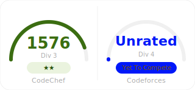

# competitive-programming

This repository contains my competitive programming solutions, organized by **platform** and **difficulty range**.

## Current Ratings:

<p align="left">
  
</p>

## Naming Convention
Each file follows:
```
<difficulty>_<problem-name>.<language>
```
Example:
```
539_coins.cpp
```
or 
```
800_4a.cpp
```

## Commit Convention
Each Commit follows : 
```
#<platform>_<difficulty>_<problem-name>
```
Example:
```
#cc_539_coins
```

## Notes
* Problems are grouped first by platform, then by difficulty.
* Difficulty corresponds to the platform’s rating system.
